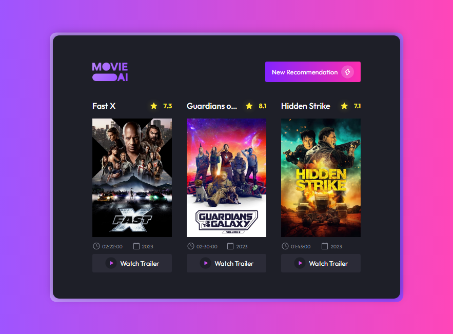

# Movie_Suggestion_BoraCodar30
Movie Suggestions Generator - boraCodar30

<strong><h1 align="center">#boraCodar - Challenge 30</h1></strong>

  

## 💻 Project
Projeto desenvolvido durante o boraCodar 30, evento de desafios de código da [**Rocketseat**](https://www.rocketseat.com.br/)  
O desafio era desenvolver um gerador de sugestão de filmes. O site utliza como base a API do [TMDB (The Movies Database)](https://www.themoviedb.org/?language=pt-BR)

Project developed during boraCodar 30, a code challenge event from:
[**Rocketseat**](https://www.rocketseat.com.br/). 

### API     
The challenge was to develop a movie suggestion generator. 
The site uses the API of [TMDB (The Movies Database)](https://www.themoviedb.org/?language=pt-BR)

